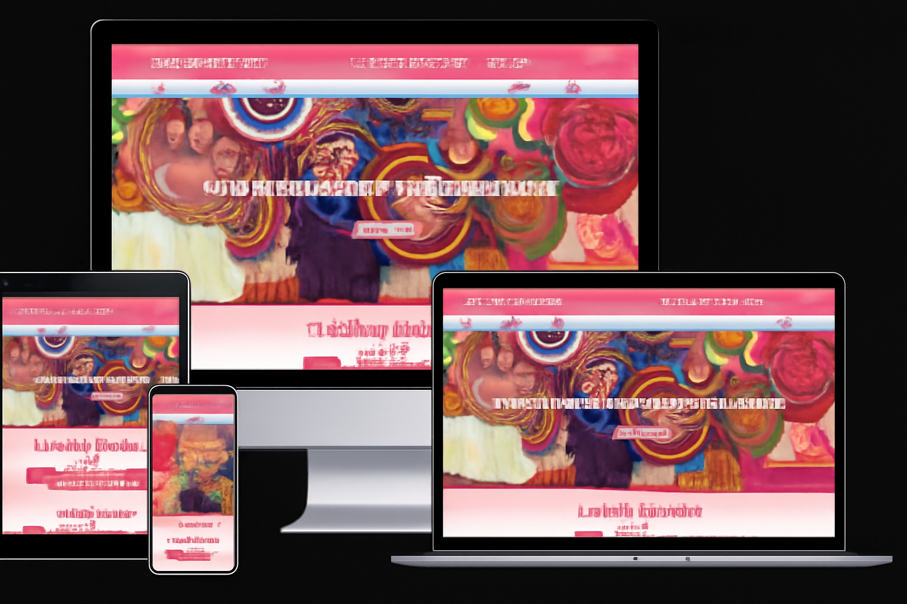
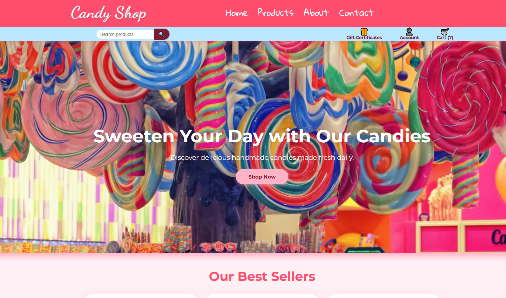
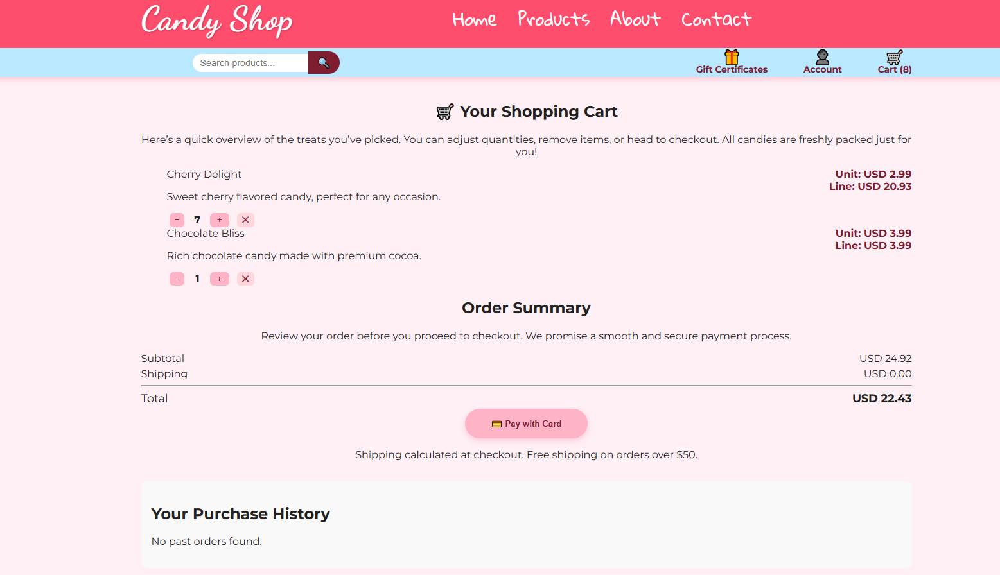
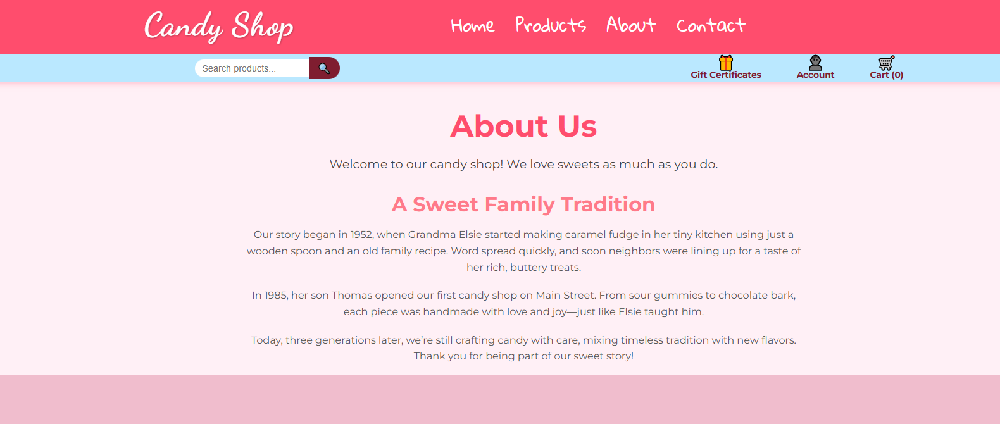
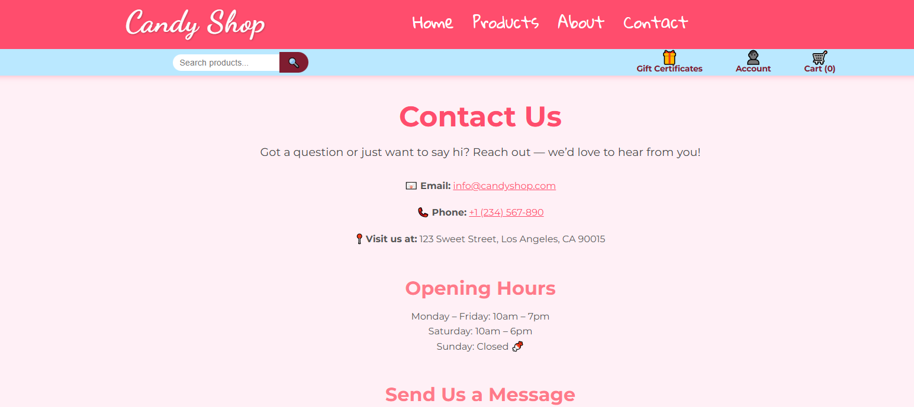
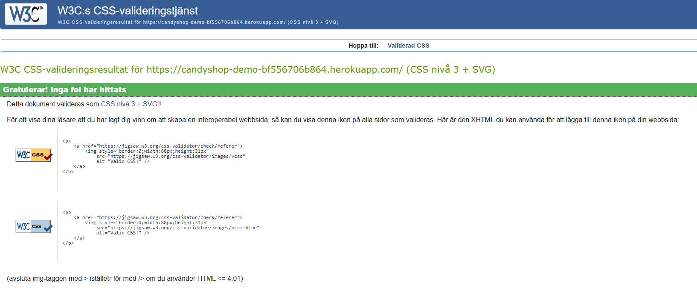
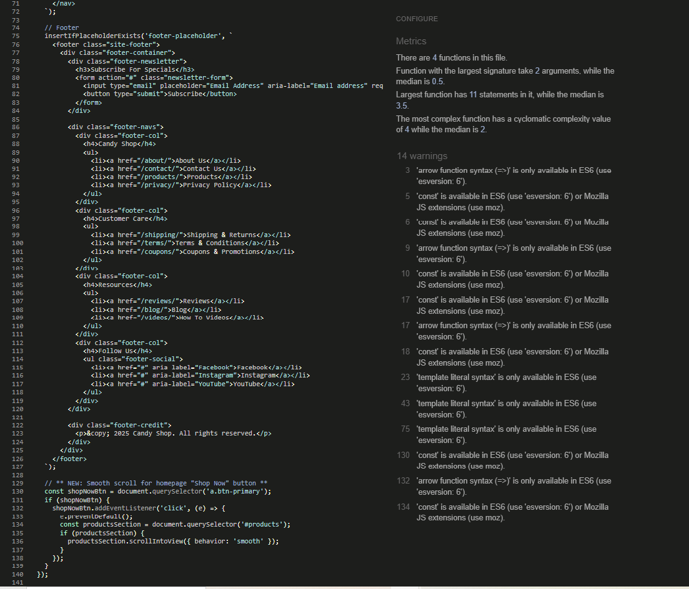
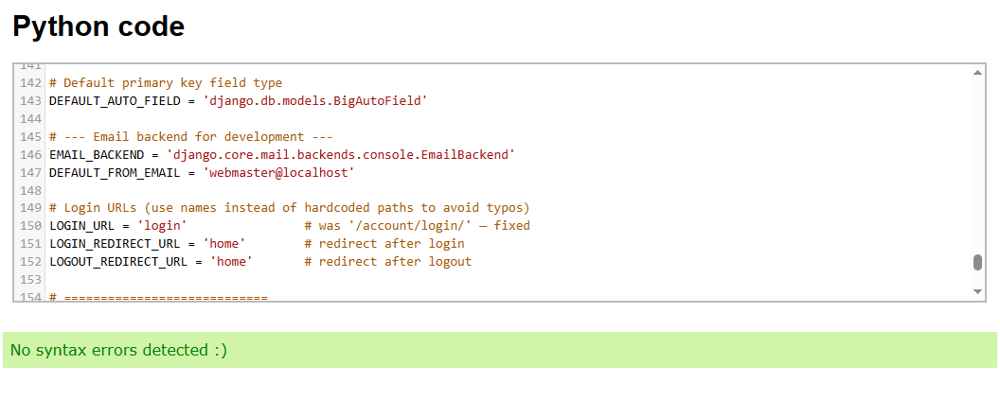

## Readme

### Table of contents:

[Theme, Epic and User Stories](#theme-epic-and-user-stories) 

[Design and UX](#design-and-ux) 
* [Wireframes](#wireframes)
* [Database model](#database-model)

[Features](#features)

[Future Features](#future-features)

[SEO and Marketing](#seo-and-marketing)

[Technologies](#technologies)

[Testing](#testing)

[Debugging and known bugs](#debugging-and-known-bugs)

[Deployment](#deployment)

[Resources](#resources)

[Credits](#credits)

[Acknowledgements](#acknowledgements)

---

**Name:** CandyShop  

**Live link:** [https://candyshop-demo-bf556706b864.herokuapp.com/](https://candyshop-demo-bf556706b864.herokuapp.com/)

**Screenshot:**


---

### Theme, Epic and User Stories

#### Theme

An online candy shop where users can browse, customize, and purchase different kinds of sweets and treats.

#### Epic

This website will provide users with a wide variety of candies, chocolates, and sweets, making online candy shopping fun and engaging. The store will be simple to use, mobile-friendly, and visually appealing. Each product will display clear details such as price, description. The site will support cart management, checkout, and user accounts for order history and saved details.

---

#### User stories

##### User

- As a **user**, I can **clearly see the purpose of the site when I land on the home page** so that **I know this is an online candy store**.  

- As a **user**, I can **see different candy products with images and descriptions** so that **I can make informed decisions before buying**.  

- As a **user**, I can **add products to my shopping cart and update quantities** so that **I can manage my purchases easily while browsing**.  

- As a **user**, I can **create an account and log in** so that **I can save my details for faster checkout in the future**.  

- As a **user**, I can **view my past orders** so that **I can reorder or track what I previously purchased**.  

- As a **user**, I can **complete the checkout process smoothly** so that **I can successfully buy candies online without frustration**.  

- As a **user**, I can **find important information like privacy policy and contact page** so that **I know the site is trustworthy**.  

---

##### Owner/Staff member

- As an **admin**, I can **add new gift certificates** so that **customers can purchase and redeem them**.  

- As an **admin**, I can **edit gift certificates** so that **details like value or availability can be updated easily**.  

- As an **admin**, I can **delete gift certificates** so that **outdated or incorrect ones are removed from the store**.  

- As an **admin**, I can **add new team members** so that **the website can show the people behind the CandyShop**.  

- As an **admin**, I can **edit team member profiles** so that **their information stays up to date**.  

- As an **admin**, I can **delete team members** so that **former staff are no longer displayed on the site**.  

- As an **admin**, I can **view messages from the contact form** so that **I can quickly respond to customer questions and support requests**.  


---

### Design and UX

The CandyShop design is built to be colorful, bright, and inviting—reflecting the fun and playful theme of candy shopping.  
A clean, light background with bold product images ensures sweets and treats stand out visually.  
For the navbar, footer, and call-to-action elements, stronger contrasting colors were used to guide the user’s attention.  
The layout is fully responsive and ensures that on smaller devices, menus and text remain readable and accessible.  

The colors implemented across the site are:

- **Primary light option:** `#ffffff` (background)  
- **Accent option:** `#ff6699` (buttons, highlights, hover states)  
- **Secondary option:** `#333333` (text and dark accents)  

---

### Wireframes

The wireframes guided the initial design of the CandyShop but the site evolved with additional features like user accounts, checkout, and admin product management.  

**Home Page**



**Cart page**



**Product detail**


**About Us page**



**Contact Page**



---

### Database model

The CandyShop database is designed to handle products, users, carts, and orders efficiently.  

**Entities:**

- **User**: Stores user information, login details, and links to orders.  
- **Product**: Stores candy details including name, description, price, image.
- **Cart**: Temporary collection of items the user intends to purchase.  
- **Order**: Stores completed purchase details including status and total price.  
- **OrderItem**: Connects products to orders and records quantity.  

---

**Entity Relationship Diagram (ERD):**


*Made in Lucidchart.*

---

### Features

**Landing page** – welcoming statement, candy-themed hero section with a bold headline, and a clear “Shop Now” call-to-action button.  

**Responsive design** – layout automatically adjusts to smaller devices. On mobile, semi-transparent backgrounds are used for text overlays to improve readability.  

**Navbar – Logo** – the CandyShop logo is prominently displayed in the navigation bar. On smaller viewports, the logo scales down for better visibility.  

**Navbar – mobile view** – hamburger menu provides an intuitive navigation cue on mobile devices.  

**Mobile dropdown menu** – includes all main navigation links, with a clear Home option for quick access.  

**Navbar – user view** – streamlined navigation with “Shop” listed first. Logged-in users can view their profile, past orders, and shopping cart.  

**Navbar – staff view** – includes product management options (add, edit, delete products) alongside personal order management.  

**Navbar – signed-out view** – shows Signup/Login instead of Logout when the user is not authenticated.  


### Shop

**Masonry-style card display** of candy products.  
Layout adjusts responsively, switching to a single column on the smallest viewports.  

---

### Product detail

Each product page includes:  
- A high-quality product image  
- Description and price  
- Options for size/quantity  
- Add-to-cart functionality  


---

### Cart

Users can review their selection before checkout:  
- Update quantities  
- Remove products  
- View product details and subtotal  


---

### Checkout

**Checkout summary** includes product list, totals, and personal details.  
Users can choose to create an account or save their details for next time.  
On larger screens, the layout includes placeholder images to balance the page.  


---

### Stripe payments

Secure checkout using Stripe.  
- Clear indication of total to be charged  
- Webhooks confirm order processing  

  
  

---

### Order confirmation

- Get a text on the page that the payment was sucessful.

### Additional Site Features


**About Us** – introduces the CandyShop, builds trust, and provides space for SEO keywords and quality backlinks.  


**Privacy Policy** – informs users how their data is handled, reinforcing site trustworthiness.  


**Footer** – includes:   
- Links to About, Privacy Policy  and more.
- Social media links for further engagement   


**Error pages** – custom 403, 404, 405, and 500 pages.  
Each includes an informative message and a "Keep shopping" button to guide users back to the store.  

---

### Future Features

- **Staff self-service product management** – ability for staff to add or update gift certifkates, teammembers directly through the django admin without developer support.  

---

### SEO and Marketing

- Optimized product names and descriptions with relevant candy-related keywords  
- Structured data for better search engine results (e.g., product rich snippets)  
- Internal linking between shop, privacy policy and About pages  
- Integration with Stripe for card payment.
- Social media promotion via Instagram, Youtube and Facebook  


---

### Technologies


**Frameworks and Tools:**
- Django (backend framework)  
- Stripe (secure payments)  
- Bootstrap (responsive styling)   
### Technologies

**Languages used:**
- Python 3  
- HTML5  
- CSS3  
- JavaScript  

**Frameworks, Libraries and Programs Used:**
- Django / allauth – Python framework for backend and authentication  
- Bootstrap 4 – responsive front-end framework     
- PostgreSQL – used in production via Heroku   
- **Stripe** – secure payment processing and webhook integration  
- GitHub – version control and repository hosting  
- Heroku – site deployment   

---

### Testing

#### HTML Validation

All HTML files were tested using the [W3C Markup Validation Service](https://validator.w3.org/).  
No errors or warnings were found.  
This confirms that the HTML structure of the CandyShop project follows web standards and best practices.


#### CSS Validation

All CSS files were tested using the [W3C Jigsaw CSS Validation Service](https://jigsaw.w3.org/css-validator/).  
No errors or warnings were found.  
This confirms that the CandyShop stylesheets are valid and meet current CSS standards.



#### JavaScript Validation

All JavaScript files were checked using a linter.  
No critical errors were found.  

14 warnings appeared, mainly related to ES6+ features such as arrow functions (`=>`), `const` declarations, and template literals (`` `${}` ``).  
These warnings indicate limited support in older browsers, but all modern browsers (Chrome, Firefox, Safari, Edge) fully support ES6 syntax.  

This confirms that the JavaScript code is valid and optimized for modern browser environments.



#### Python PEP8 Validation

All Python files in the project were tested using **PEP8 (flake8)** standards.  
The test returned **no errors**, confirming that the Python code follows proper formatting and style guidelines.  

This ensures that the codebase is clean, consistent, and easy to maintain.



#### Lighthouse Testing

The project was tested using **Google Lighthouse** in Chrome DevTools to measure overall site quality.  
The following results were obtained (mobile view at 320px width):

- **Performance:** 84  
- **Accessibility:** 96  
- **Best Practices:** 79  
- **SEO:** 91  

These results indicate that the site performs well across most categories.  
- Accessibility and SEO scored very high, ensuring usability and discoverability.  
- Performance scored 84, showing good loading times and responsiveness, but with some room for optimization.  
- Best Practices scored 79, suggesting minor improvements could be made to align fully with modern web development standards.

Overall, the Lighthouse audit confirms that the site is well-optimized, accessible, and user-friendly.


---


### Debugging and Known Bugs

- **Cart quantity validation** – users can add up to 100 of any single product.  
  - Works correctly on the final checkout page, but on the cart page users can temporarily enter a number above 100.  
  - When they try to update totals or proceed, they receive an error preventing checkout with more than 100 of a single product.  
  - Will be fixed in the next iteration to validate at cart-level as well.  

- **Calculation logic** – originally product calculations (for pricing variations) were placed inside the model.  
  - This caused issues, so logic was moved into the views with cleaner functions.  
  - Variables (size, flavor, etc.) are passed into the functions.  
  - While not as elegant as desired, this avoids duplicating large chunks of code.  

✅ No other known bugs at this time. If you encounter one, please report it to: **outproudproject@gmail.com**

---

### Deployment

#### Publishing

The project was deployed using **Heroku**. Steps followed:

1. Sign up or log in to [Heroku](https://www.heroku.com/).  
2. On the dashboard, click **New → Create new app**.  
3. Choose a region and project name, then click **Create app**.  
4. In the app dashboard, navigate to **Settings → Config Vars**.  
   - Add Cloudinary URL, Postgres credentials, `SECRET_KEY`, Stripe API keys, and other required variables.  
   - Save them, and ensure they’re also stored locally in `env.py` (which must be added to `.gitignore`).  
5. Navigate to the **Deploy** tab. Connect the app to GitHub.  
6. Choose either **manual deploys** (update when you choose) or **automatic deploys** (deploys on every push).  
7. After the first push, Heroku will build and deploy the app.  

#### Forking and Cloning

To save and work with a copy of this repository:  

- **Forking**:  
  - Click the **Fork** button at the top-right of the repo page on GitHub.  
  - This creates a personal copy of the repo in your GitHub account.  

- **Cloning**:  
  - On the repo page, click **Code → Download ZIP** to get a local copy.  
  - Or copy the HTTPS/SSH link under **Code** and run:  
    ```bash
    git clone <repo-url>
    ```  
  - You can also choose **Open with GitHub Desktop** if you use that tool.  

---

### Resources

- [Django 3.2 documentation](https://docs.djangoproject.com/en/4.0/)  
- [Bootstrap 4 documentation](https://getbootstrap.com/docs/4.6/getting-started/introduction/)  
- [Cloudinary documentation](https://cloudinary.com/documentation)  
- [Stripe documentation](https://stripe.com/docs)  
- ERD made with [Lucidchart](https://lucid.app/)  
- Wireframes made with [Balsamiq](https://balsamiq.com/)  
- Privacy Policy generated with [Privacy Policy Generator](https://www.privacypolicygenerator.info)  
- Sitemap generated at [xml-sitemaps.com](https://www.xml-sitemaps.com/)  

---

### Credits

- **Code Institute Boutique Ado** project – reference for shopping basket, checkout, and Stripe integration.  
- **Images** – all candy product images from [Pexels](https://www.pexels.com/) unless otherwise stated.  
- **Peer feedback** – suggestions on responsive design (transparent text backgrounds on landing page) from Code Institute Slack community.  
- In-code credits are provided where relevant.  

---

### Acknowledgements

Special thanks to my mentor **Brian Macharia** for guidance and support throughout this project.  
